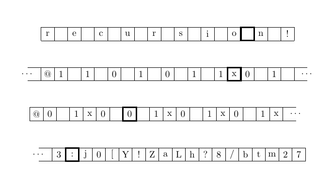

# TikZ Turing machine tape generator

This Python script provides a function, `generate_tikz_tape`, that generates
[LaTeX](https://en.wikipedia.org/wiki/LaTeX) source code for a
[TikZ](https://en.wikipedia.org/wiki/PGF/TikZ) diagram consisting of a grid of
squares. The squares contain characters from a given input string, with an
ultra-thick border around a specified square, a customizable total number of
squares and a few style options.

It is intended to quickly and conveniently produce a representation of the
contents of a [Turing machine](https://en.wikipedia.org/wiki/Turing_machine)'s
tape in the same style as that in Charles Petzold's (highly recommended) book
[_The Annotated Turing_](https://www.charlespetzold.com/books/),
which expands on Alan Turing's 1936 paper on computability.

## Function signature

`generate_tikz_tape(s: str, index: int, length: int, style: str) -> str:`

## Examples and usage



Code for the second example in the preceding figure:
```
s = "@1 1 0 1 0 1 1x0 1"
index = 14
length = 20
style = "lrc"
tikz_code = generate_tikz_tape(s, index, length, style)
```

## Parameters

* `s`: The input string to be displayed inside the tape's squares.
* `index`: The index of the square to be highlighted with an ultra-thick
  border, representing the current position of the machine's head.
* `length`: The number of squares (excluding extra squares) in the tape.
* `style`: A string specifying some options for the tape. The presence of
  the characters `c`, `l` or `r` has the following effects:
    * `c`: Center the TikZ picture on the screen.
    * `l`: Add two extra squares at the beginning, with left edges
      missing and "..." displayed.
    * `r`: Add two extra squares at the end, with right edges
          missing and "..." displayed.

## Output 

A nicely formatted string containing the entire LaTeX TikZ code for the
generated grid diagram.

## Writing the output to a text file

Because the LaTeX code spans several lines, it is automatically written to a
file named `tikz_code.txt` in the same directory. To write into another file,
search the script for the line:
```
with open("tikz_code.txt", "w") as file_object:
```
and replace `tikz_code.txt` with the desired file's path. If the file does
not yet exist, it will be created when the script is run. (__Caution__: if the
file already exists, its contents will be replaced by the generated LaTeX code
everytime the script is run!)

## Dependencies

A LaTeX distribution with the TikZ package installed is necessary to compile the
generated TikZ code into a graphical representation. 